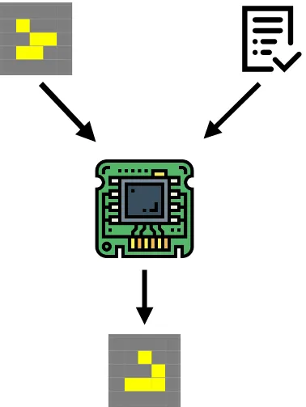
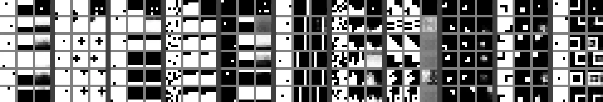

Disclaimer: this text is prepared for readers who already familiar with the ARC challenge. If you don’t know what it is, you can take a look at [the github page of the challenge](https://github.com/fchollet/ARC) and [the original paper “On the Measure of Intelligence”](https://arxiv.org/abs/1911.01547) by François Chollet.

The main idea is to produce a system that consists of two differentiable parts — a programmer and a computer.

The first part of the system — programmer — takes three inputs: an input data that should be processed, an output data that should be generated and the current state of the program that supposed to covent an input data into an output data. The task of the programmer is to generate a better version of the program.

The second part of the system — computer — takes two inputs: an input data and the program. The task of the computer is to apply the program to the input data and produce an output.

In actuality the programmer and the computer are both the neural networks and the program is a N-dimensional vector. Because both of the parts are differentiable we could backpropagate through the whole system to train both programmer and computer to work coherently. Furthermore we may propagate through several steps of the pipeline to get better results. With this architecture we could have a system that may take an arbitrary number of examples and produce a solution to a new input based on the program it comes up with.

To test this idea I created a small dataset resembling the ARC, that was partially created by hand and partially generated on the fly, but with some additional restrictions: all tasks have 6x6 grids, each cell has only two states (black and white), all tasks have exactly 5 examples.

Here is a little glimpse of how the network performed on the tasks:

Each column (3x6) here represent one task. Inside the task first colum represent an input, second — an output and the third — a guess of the networks considering all previous examples and current input given.

In my experiments this system worked really well for procedurally generated tasks, a bit worse on the in distribution data and horrible on the out of distribution data. In other words, it could solve the type of tasks it saw, but almost always failed on novel ones. Although the scale of the experiments was miniscule and all networks were composed of several fully-connected layers, so there are still a potential to make it work.