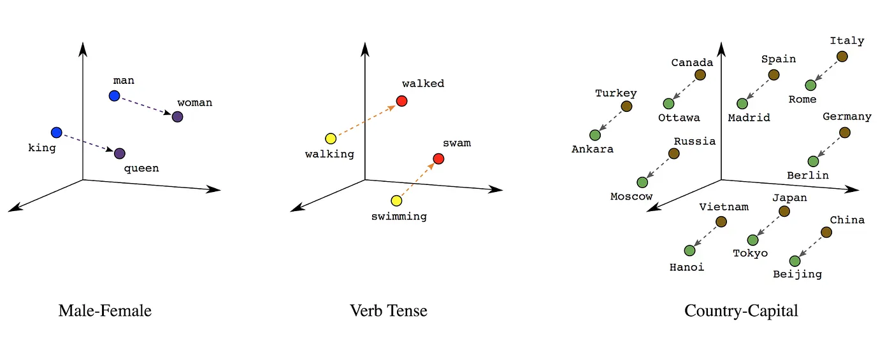
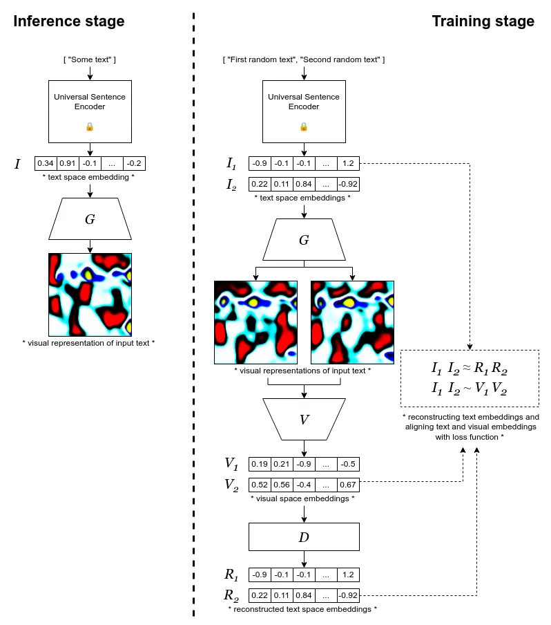
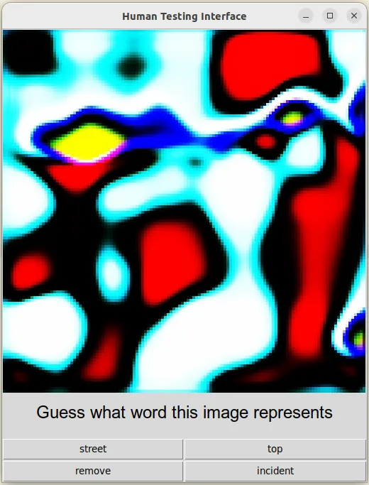

## Introduction

In the movie Arrival (2016) a group of scientists tries to learn the language of extraterrestrial aliens that arrived on Earth and by doing so they change the way they think which allows the main character to obtain some extraordinary power. While such power is in the domain of fiction, the theory that our language dictates the way we think [has been widely explored in the literature](https://en.wikipedia.org/wiki/Linguistic_relativity).

There is a main crucial distinction in how people and current AI systems process information. All major human languages are based on discrete bags of words, while ML models almost always obtain and output information in terms of lists of real values. Because of this, all NLP models have a process of “vectorization” when a whole word, part of it, or single characters obtain their own vector representation that conveys their internal meaning accessible for further processing within the models. The main benefit of vectorization is that these vectors are continuous, therefore, could be adjusted (trained) through backpropagation. In a world of NLP models, the words “planet” and “moon” have some distance between each of them and could be gradually transformed from one to another.

Here is where the first glimpse of a new superpower will show up. Because of the discrete nature of our language people tend to think in terms of types, even when these types cannot be properly defined. The most obvious examples of it are in cosmology. There are some types of objects that at first glance fit very well into our discrete view of the world: planets, moons, stars, comets, asteroids, black holes and so on. But there are also some in-betweeny objects such as black dwarfs that are neither a planet nor a star but have properties of both depending from which angle you look at it. And there is Pluto… that was a planet, but lost its status when the definition of a planet was changed. The thing is, there is an ongoing debate that this new definition is not purely scientific and based on a recent observation of Pluto’s geological activity, [it should be a planet after all](https://www.sciencedirect.com/science/article/pii/S0019103521004206). The type system breakes when we find something that lies on the boundary between the types. And most of the time, a new type is created alongside a bunch of new boundaries that wait to be filled with new exceptions. It seems that it would be beneficial to have a language that does not have these boundaries in its nature and works more closely with how ML models work. So, here comes the question: **could we create a language that is understandable by a human but works in a continuous fashion?**

## Vector Based Language

In some sense, we already have a continuous language in the form of images. If we ask one human to draw a house and ask another what this image means, we have a high chance that the guess would be right. And a list of images might tell stories just as a sentence does. But there is a problem, for any word in a language there are infinite possibilities of depicting it in the form of an image, and then there are even more possibilities of interpreting the image back to words. So the language made of regular images would not be very reliable in conveying an exact meaning that was originally intended. To overcome this problem, we need a system that could generate some sort of an image for every word given and could guarantee that this image might be converted back to the original word exactly.

The main tool we are going to use in the pursuit of developing such language is, once again, machine learning. The setup will look like this: there is a pre-trained language model that takes a word or a sentence as an input and produces some vector representation of it, there is also a second model that transforms this vector into some human-readable format, and lastly, there is a human who has to guess the original word that has been given. The human is allowed to take any time necessary to learn how the system works.

## Architecture

The general thing we want to achieve is to have a model that generates some embedding of the given text and then produces a visualization of these embeddings. To obtain embeddings of text, we will use [universal sentence encoder](https://arxiv.org/abs/1803.11175) from Google, and to generate the visualization we will train generator network G. To do so, we need to have some approximation of the human visual system to make resulting images human-readable. In our case, this approximation would be a network V that we will initialize with mobile-net-v2 weights and allow these weights to change at the training stage.

We are leaving the vision model trainable as it would bring another layer of regularization to the system. If we don’t do that and freeze the model, the decoding network tends to exploit inaccuracies in the visual model and settles on the solution that has a good reconstruction rate, yet all images are still pretty much the same, and only subtle differences are present that are very hard for a human to notice.

We train this architecture with the following loss function:

Where G — generator network, V — vision network, D — decoder network. I_1 and I_2 are embeddings of two randomly generated sentences.

Here, the purpose of L_1 term is to make sure that distances in visual latent space are roughly the same as distances in word embeddings space. L_2 keeps images generated by G as far apart as possible in RBG space. L_3 keeps images generated by G as far apart as possible in visual space while keeping its mean at 0. L_4, the most important term, makes sure that reconstructed word embeddings are the same as initial ones. Values for α, β, γ are found empirically.

To make the generator to be able to produce a meaningful image from any point of embedding space of the universal sentence encoder and prevent overfitting, we have to probe the space as densely as possible at the training stage. To do so, we will generate random sentences with the help of [nltk](https://www.nltk.org/) library. Here are the examples of such generated sentences: ‘ideophone beanfield tritonymphal fatuism preambulate nonostentation overstrictly pachyhaemous’, ‘hyperapophysial’, ‘southern’, ‘episynaloephe subgenerically gleaning reformeress’, ‘trigonelline’, ‘commorant saltspoon’, ‘nonpopularity mammaliferous isobathythermal phenylglyoxylic insulate aortomalaxis desacralize spooky’, ‘speed garn nunciatory neologism’, ‘podobranchial fencible’, ‘epeirid gibaro’, ‘sleeved’, ‘demonographer probetting subduingly’, ‘velociously calpacked invaccinate acushla amixia unicolor’ and so on.

## Testing

To test if our methods are doing well we are going to use the reconstruction rate metric. To calculate the metric, we need to collect [2265 most common English words](https://www.talkenglish.com/vocabulary/top-2000-vocabulary.aspx) and expand this list with 10 digits. A random word gets converted to its embedding with the [universal sentence encoder](https://arxiv.org/abs/1803.11175) and passed to the generator that generates the image representing the word. Then, depending on who is the test subject (human or machine) we use one of the following:

For a machine, we pass generated images to the pre-trained visual network and then decode it with decoder network D to get back the word embedding. We compare this new embedding with all embeddings in the dictionary, and if the euclidian distance from the new embedding to the original embedding is the smallest, we give the point to the system. After checking all the words in such a way, we obtain:

reconstruction rate = correct answers / number of words * 100%.

<figure>
    

        
        
    

    <figcaption>Presentation of Human Testing Interface</figcaption>
</figure>

For human testing, we give a generated image to the test subject with a visual interface that presents the image with four possible answers. Human should learn through trial and error what word each image represents and report their best score. To make this task more convenient, at the beginning of the session, the testing interface asks what size of the dictionary the participant wants to use. The dictionary itself consists in a way that it’s growing from the most to less common English words. Volume of the dictionary is separated by the following levels: 10, 20, 40, 100, 200, 400, 1000, and 2275 (full dictionary). Here is a sample of the first 30 words presented in the dictionary:

0, 1, 2, 3, 4, 5, 6, 7, 8, 9, the, of, and, to, a, in, is, you, are, for, that, or, it, as, be, on, your, with, can, have… and so on.

In the human case, the reconstruction rate is calculated by the exact same formula. To check the accuracy, the test subject is supposed to answer 100 questions with full dictionary size. Although it is worth noting that the random baseline for humans is 25% as it is always possible to simply guess the right answer from the 4 options presented.

## Results

After training the system, it was producing the following images for respective input sentences:

The reconstruction rate for the decoder network at the end of the training was 100%, and the loss value was 0.02.

I did the experiment of learning this language on myself and was able to achieve a 43% reconstruction rate after two weeks of training. It was beneficial for me to start from a small number of words and gradually increase this number with less and less common words. The promise was, that at some point you do not really need to remember each image, the meaning of the word should be deducible from the geometry presented in the image. So learning such a language should be much easier than learning a typical natural language. While learning I used the 85% threshold to make sure that I’m ready to increase the volume of the dictionary.

Here is how a two-week learning progress looked like for different dictionary sizes:

While bigger dictionaries became progressively harder to learn, the upward trend is clearly visible in all cases. This proves the most important point that answers the question that was set at the beginning. **We can create a language that works in a continuous fashion and such language is learnable by a human.** While implications of this are yet to be known, in the next section, I will speculate on some that might be interesting to investigate further.

The source code and pre-trained models are available on the project’s GitHub page: [https://github.com/volotat/Vector-Based-Language](https://github.com/volotat/Vector-Based-Language)

Full training history is available here: [https://github.com/volotat/Vector-Based-Language/blob/main/article/history.csv](https://github.com/volotat/Vector-Based-Language/blob/main/article/history.csv)

## Thoughts

To my knowledge, that is the only example of a synthetic language that possesses a notion of continuity where words and even sentences could blend into each other. I suggest that such language should be interesting even as an example that such a thing is possible in principle. I hope this may make someone fascinated by the idea to explore it further in their own right.

I think that the most promising aspect of such language is the combination of it with some sort of brain-computer interface. The obvious downside of the language at the current stage is that there is no clear way to produce the image directly from the intent rather than words. With good enough BCI, this problem could be solved. Therefore such language might be the first way to store thoughts in human-readable format.

With the rise of foundation models, and especially text2image generators, such as [Stable Diffusion](https://github.com/CompVis/stable-diffusion), there is a need to produce and store concepts that could not be easily conveyed with words but still could be represented as embeddings. There is recent work called [Textual Inversion](https://github.com/rinongal/textual_inversion) that tries to solve this exact problem. With language like this, we could visualize these embeddings in a meaningful way and even use it as a common concept space for many models in the future.

The language might be significantly improved to be more human-friendly. For example, we can use more advanced models such as CLIP (to be more specific, an image encoder part of it) as a visual model at the training stage to produce more readable images. Or we could use a set of predefined text-image pairs as anchors for more controllable outputs.

And lastly, to really show that generated images represent the meaning of the words rather than the words themselves…

