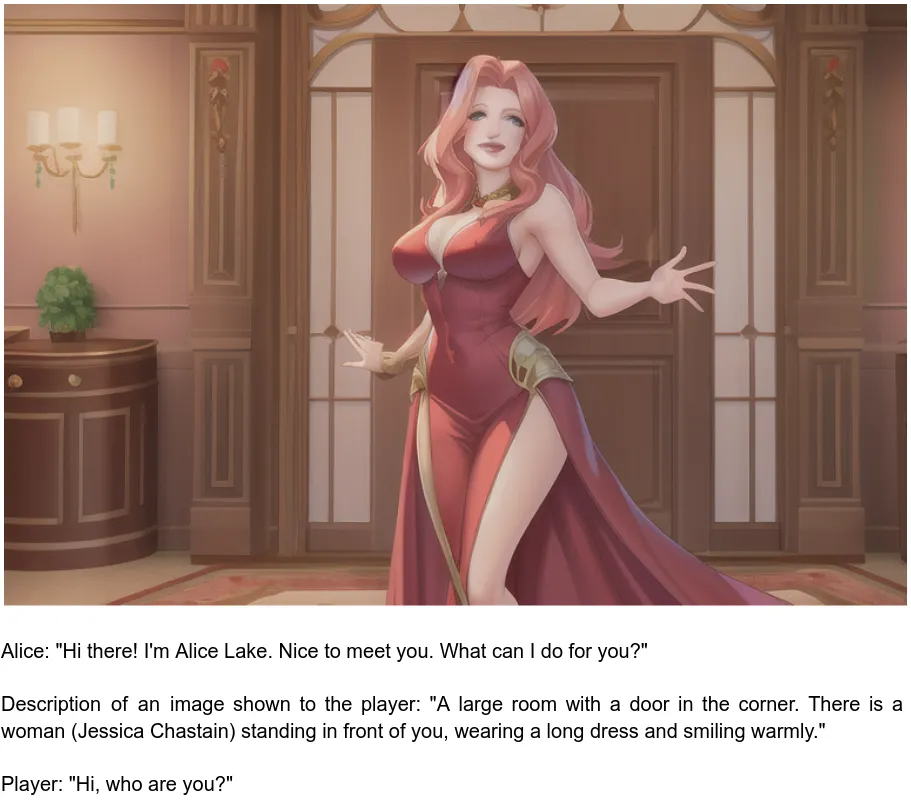

The Holy Grail of all RPG games always was an AI that could reliably reply to what the player says and react to his actions. This was openly pronounced right from the beginning of the genre when text-based games started being developed. However, despite decades of research, there still has not been a perfected AI for RPGs that can truly understand and react to natural language. With the appearance of GPT-3 and other large language models a glimmer of hope appeared. Yet as the world of RPGs is so large and open-ended, it requires an AI with a vast amount of understanding and context about the environment and the player’s actions in order to be able to produce realistic responses. This means that creating an AI which can reliably interact with players is an extremely difficult task — one which has yet to be achieved. Although [AI Dungeon](https://aidungeon.io/) seems to be a good step forward.

There is another genre of games that could be a perfect petri dish for such an AI — [**Dating sims**](https://en.wikipedia.org/wiki/Dating_sim)**.** Relying heavily on the text they are much closer to situations to what GPT-3 is used to deal with. They usually have a few characters and most of the time do not present any real challenge to the player, rather just telling a story the author of the game had in mind. Another selling point of dating sims is the great art that the game presents to the player. Here is where our new cool kid — Stable Diffusion — could show himself in full glory. The idea seems obvious, we should use GPT-3 to generate interactive stories and prompts for Stable Diffusion, that would generate images for that story. Even better, with technology like [DreamBooth](https://dreambooth.github.io/) that allows us to introduce new concepts to image generation model, we should be able to produce coherent locations, characters and style of the images. But will it really work in practice?
To test this idea I decided to emulate a dating game within a simple text document.

The GPT-3 prompt I used was looking in the following way:

> The following is the dialog between the character Alice Lake (Jessica Chastain) and the player.
> Alice Lake (Jessica Chastain) does not know the player yet, but is very happy to meet him and help with anything he is asking.
> The following happened in the big house where the player woke up with huge pain in his head.
> …
> Short summary of the dialog so far: "[First GPT API call, do not need to call it if it is the first message]"
> Alice: "[Second GPT API call]"
> Description of an image shown to the player: "[Third GPT API call]"
> Player: "[player's input]"

“…” — represents the previous state of the dialog. Because we have a “Short summary of the dialog so far” section that works like a long-term memory, we do not need to store more than the last two messages.

Here is the first message from the character, description of an image shown to the player and the actual image generated from this description, as well as player’s answer to the character:

I used the [Anything-V3](https://huggingface.co/Linaqruf/anything-v3.0) model as it could generate visually pleasing results consistently, without too much prompt engineering. To not waste time training the DreamBooth model for coherent rendering of characters I simply used a famous person, in my case this was Jessica Chastain, as a character anchor and vague description of the clothes in the prompt. In the end the prompt I used to generate images was the following:

> Prompt: [Description of an image from GPT-3] + “Detailed photo-realistic anime style. Inside a house. Tight red dress.”
> 
> Negative: (((ugly))), fake image, blurry image, blur, corrupted image, old black and white photo, out of frame, without head, too close, cropped, collage, split image

I tried to keep the first image that was generated, although I did allow myself to regenerate an image if it was completely off as it happened a couple of times.

The first pleasant surprise I got was when I asked Alice’s character to give me a cup of coffee. I was expected to see another simple close up view of the character but instead got this:

As we could see the description of an image does not contain two cups of coffee, so this was just a coincidence, although it was not the last such a surprise. When I asked Alice to find my documents I got an image of her actually looking around the house.

At this point it was clear that the idea in general was working. As the next step I tried to see limitations of the system. I tried to “get rid” of the character and make it show me some inanimate object. I hoped that GPT-3 would generate a description of an image that does not contain Alice, but it kept her in nevertheless.

At some point GPT-3 decided to put the player into the image. Here is where the most important limitation became clear — for a coherent story not only the image should depend on the dialog, the dialog itself should also depend on the generated images.

The main takeaway of this little experiment that I got is that we are very close to creating believable characters powered by an AI. The only thing we really need is a multimodal approach as powerful as GPT-3 and Stable Diffusion combined, able to generate text and images as a coherent stream of tokens. It would also be beneficial to have some sort of memory in the form of learned special tokens that contain information of the previous events in a compressed form as the “Short summary of the dialog so far” section does. The good news, that new models like [Flamingo](https://arxiv.org/pdf/2204.14198.pdf) from DeepMind could do exactly that.

The whole story I got by interacting with “the game” is available in [this document](https://docs.google.com/document/d/1G4f0ta9f2T_WtRbGY7qFEBbh2dH2zrnVt7yNK-KjKnk/).

Let’s see what the future holds for us…